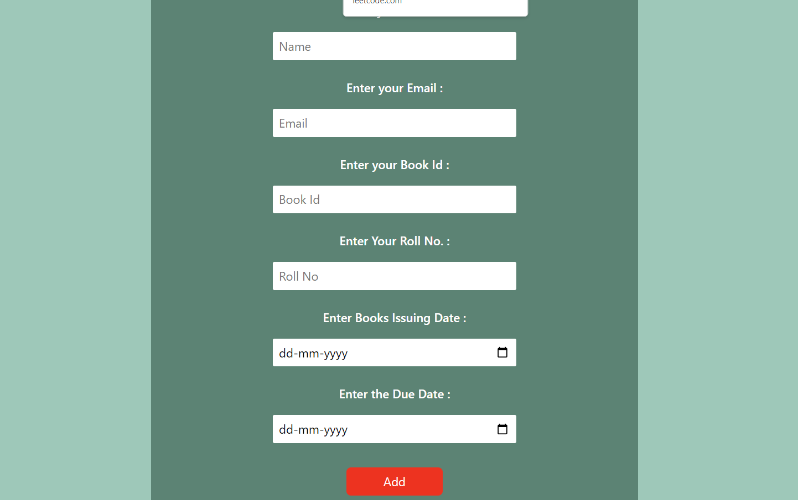
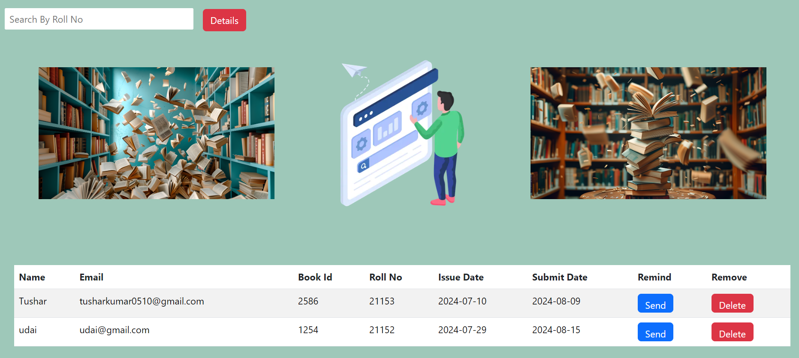
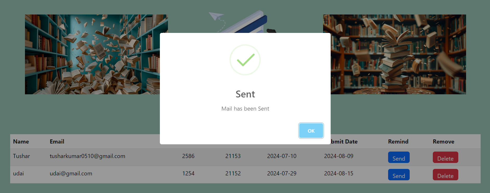
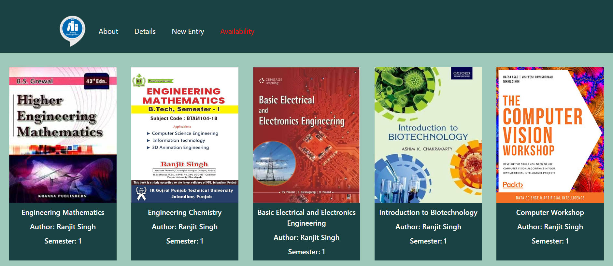
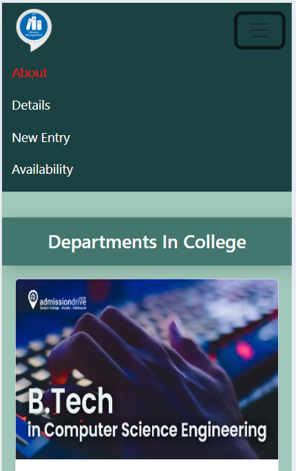

# Library Managemnt MERN project

## Features

- Easily Issue New Books
- Delete the entry for Books
- See the Available and Issued Book Details
- Get the Notification for Due date of submission of Books

## API Reference

#### Get the Issued Books Details

```http
  GET /details
```

| Parameter | Type     | Description                |
| :-------- | :------- | :------------------------- |
| `_id` | `string` | **Required**. To Fetch the Detail |

#### To delete the Entry of Any Issued Book

```http
  POST /removeData
```

| Parameter | Type     | Description                       |
| :-------- | :------- | :-------------------------------- |
| `_id`      | `string` | **Required**. Id of item to be Removed |

#### To Issue New Book

```http
  POST /entry
```

| Parameter | Type     | Description                       |
| :-------- | :------- | :-------------------------------- |
| `Books Id, User email, password `      | `string` | **Required**. To add new Entry of Issued Books |

#### sendMailInfo(email,date)

Takes email and the Due date of Books submission to remind the user to return the book.

## Appendix

I have used Reacts, Express.js, Mongodb, Bootstrap in this project.


## Installation

Install my-project with npm

```bash Run  1 command then press enter and similar for all other
  cd frontend
  npm i .
  cd ..
  cd backend
  npm i .
  cd ..
```
    
## To Run

Install my-project with npm

```bash Run these commands one by one
  cd frontend
  npm start

```
Open One More terminal to run Backend Simultaneously

```bash Run these commands one by one
  cd backend
  nodemon app.js
```

## Screenshots

### Main Interface


### Admin login


### Admin panel


### Issued Books details


### Send Remainder



### Available Books


### Responsive design


## Authors

 [@Tushar Kumar](https://github.com/tusharkumar07)
